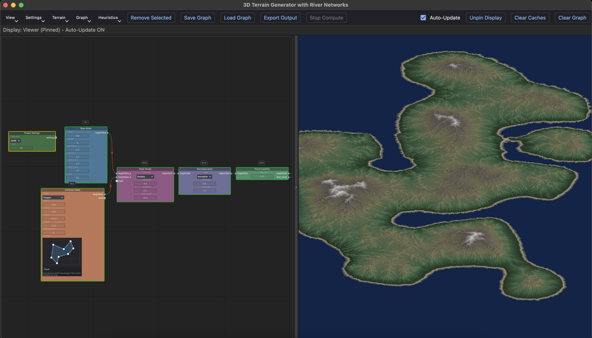
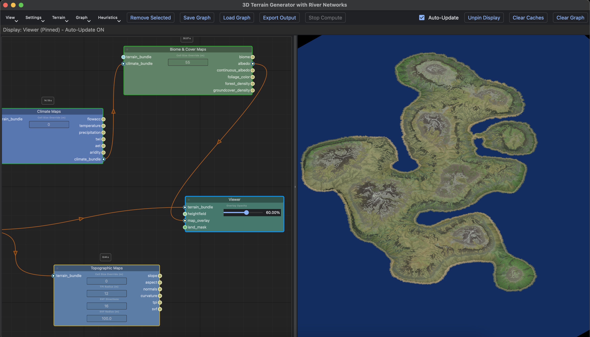
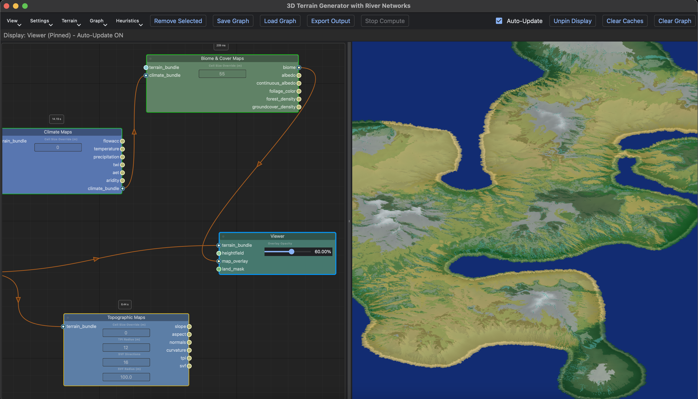

# Python Geomorphology

This is a node based terrain generation program written in Python. The purpose is to provide a flexible and performant way to generate continent-sized terrain heightmaps for games. The tool supports graph based erosion simulation, particle based erosion, and thermal erosion to shape the terrain from an initial map generated with noise. The tool also supports generation of various terrain heuristic maps, such as slope, aspect, TPI, and more. In addition, climate simulation can be perfomed to classify parts of the terrain into different biomes.






## Installation and Usage

1. Clone the project.
2. ```pip install -r river-networks/requirements.txt```
3. ```python river-networks/main.py```